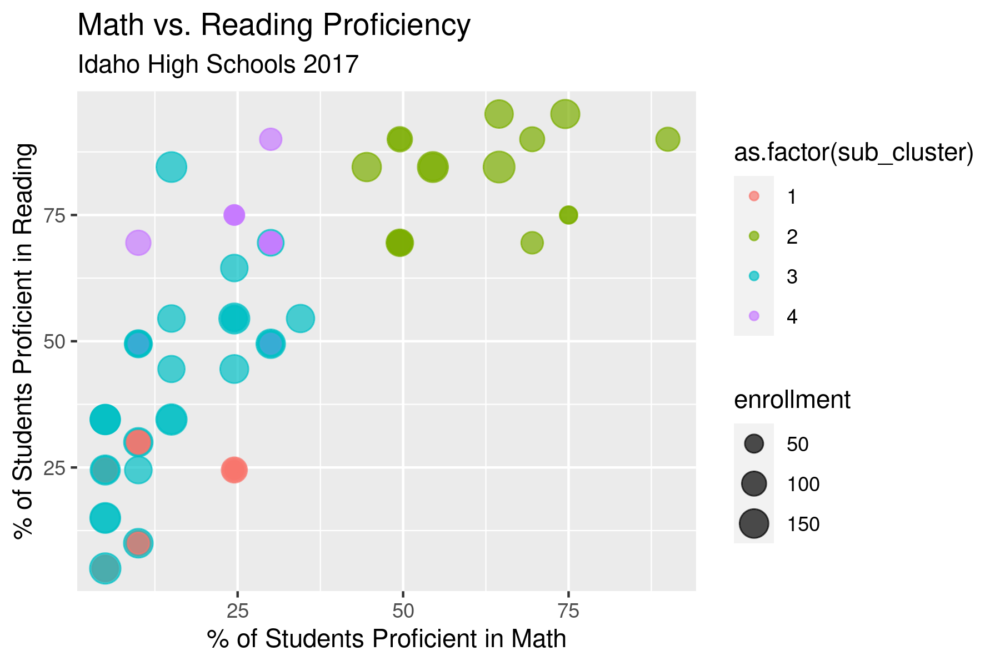

# Idaho High School Clustering

A brief data analysis project for ISYE 7406 (Data Mining) done in R.

The source code can be found in the `project.Rmd` file. 

### Executive Summary

The primary drive for this project was to visually identify struggling schools in Idaho. 

While the available time for this assignment was too short for a full analysis, we were able to make considerable progress. Of particular relevance are findings relating to low math proficiency, differences between races/genders, and the capability to categorize schools algorithmically.

Clustering of schools proved especially interesting. Rather than comparing all Idaho schools to one another, clustering allowed us to separate them into similar categories by qualities such as enrollment or standardized test scores. This in turn opens up the possibility of providing targeted treatments, as well as identifying schools that are struggling when compared to those of a similar makeup.

### Key Takeaways and Visuals

***Data Size***

* Idaho had 210 reporting high schools in 2017

* Student proficiency rates vary widely between schools

***Median Proficiency Rates***

* At the median school, 55% of students were reading proficient according to the ISAT exam

* At the median school, 25% of students were math proficient according to the ISAT exam

* Proficiency is defined by the state as "a level of performance that approximates an A" in the associated subject

***Sex Differences***

* Students that identify as female demonstrate considerably higher proficiency rates in reading for reasons unknown

***Race Differences***

* Most Idaho schools do not report race-specific scores due to low student populations

* Of the 210 schools, only 105 were able to report on two or more races ("white" and "hispanic")

* Of the available data, a considerable difference can be seen between the two race populations

***School Clustering***

* K-Means clustering was used to separate schools into individual clusters

* A Decision Tree was used to help interpret the output of the clustering process

* From this, we can see that clusters predominately reflect enrollment

***Sub-Clusters***

* Individual clusters can be clustered again to drill down further into underlying data (cluster 1 is pictured above, further subdivided into four sub-clusters)

* Sub-clusters reflect differences in assessment results as well as enrollment size
